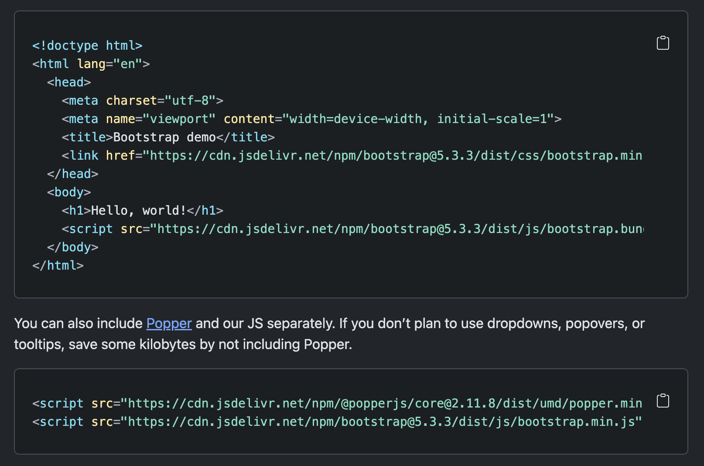
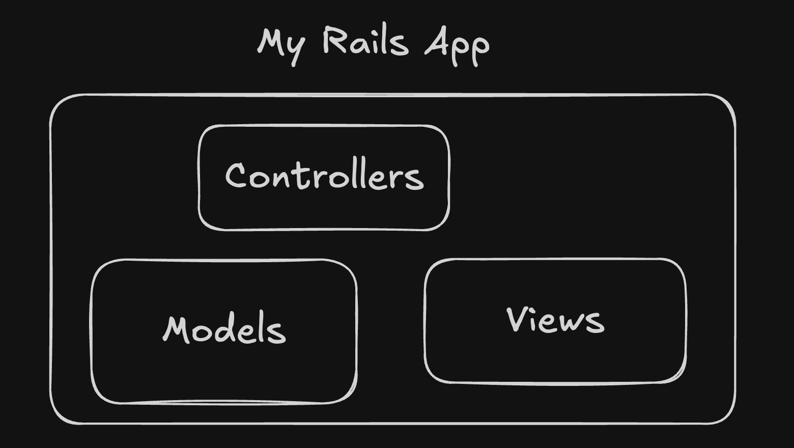
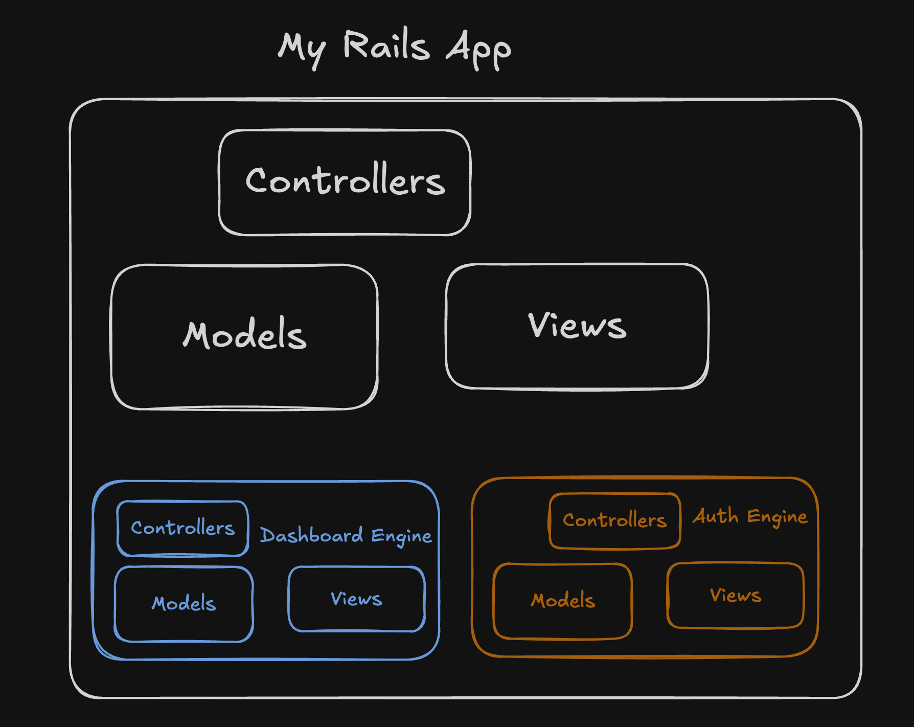

# RSCs as "shippable" fullstack modules

---

# Hi

---
layout: center
class: text-center
---

# "Shippable" "fullstack" "modules"

<!-- <div class="mt-12!" v-click>

> "Idea of bundling a piece of functionality into a SHARABLE <i>thing</i>"

</div> -->

---

# "Shippable" "fullstack" "modules"



---
disabled: true
---

# Packaging? Modules? What?

"wp-plugins with a bunch of git changes"

---
layout: center
---

# Yeah... not the most ideal

---
layout: center
---

# "component"

---

# "component"

````md magic-move {lines: true}
```tsx
const Post  = React.createClass({
  getInitialState() {
    return { loading: true, data: null };
  },

  componentDidMount() {
    fetch(`http://company.com/api/posts/${this.props.id}`)
      .then(response => response.json())
      .then(data => this.setState({ loading: false, data }));
  },

  render() {
    if (this.state.loading) {
      return h('div', {}, 'Loading...');
    }

    return (
      h('div', {},
        this.state.data.map(post =>
          h('p', {}, post.title)
        )
      )
    );
  }
});
```

```tsx
class Post extends React.Component {
  constructor(props) {
    super(props);
    this.state = { loading: true, data: null };
  }

  componentDidMount() {
    fetch(`http://company.com/api/posts/${this.props.id}`)
      .then(response => response.json())
      .then(data => this.setState({ loading: false, data }));
  }

  render() {
    if (this.state.loading) {
      return <div>Loading...</div>;
    }

    return (
      <div>
        {this.state.data.map(post => <p key={post.id}>{post.title}</p>)}
      </div>
    );
  }
}
```

```tsx
function Post(props) {
  const [loading, setLoading] = useState(true);
  const [data, setData] = useState(null);

  useEffect(() => {
    fetch(`http://company.com/api/posts/${props.id}`)
      .then(response => response.json())
      .then(data => {
        setData(data);
        setLoading(false);
      });
  }, [props.id]);

  if (loading) {
    return <div>Loading...</div>;
  }

  return (
    <div>
      {data.map(post => <p key={post.id}>{post.title}</p>)}
    </div>
  );
}
```
<!-- 
```tsx {all|1,12|5,7-9,13-14|4,16}
import css from 'who-still-uses-modules.module.css'

const Post() {
  const like = useLikeMutation();
  const { data } = usePostQuery();

  if(!data) {
    return <h1>Loading...</h1>
  }

  return (
    <div style={css.container}>
      <h1>{data.title}</h1>
      <p>{data.body}</p>

      <button onClick={like.mutate}>Like</button>
    </div>
  )
}
``` -->
````

---
layout: center
---

# We've been doing this for a while and it's dope

---
layout: image
image: ./assets/forgetting.jpeg
backgroundSize: 20em 70%
---

---
layout: center
---

# What about "server" integrations?

---
layout: center
class: text-center
---

# Anyone here a rails/django dev?

(or heard of rails engines / django apps)

---



---



---
layout: center
---

# Rails engine -> "mini app" -> "fullstack module"

---
disabled: true
---

# "Fullstack module"

<ul class="mt-10">
  <li v-click> View (template / style) </li>
  <li v-click> Interactivity (Client JS) </li>
  <li v-click> Server fetching </li>
  <li v-click> Server mutations </li>
  <!-- <li v-click> DB? </li> -->
</ul>

---
layout: center
---

# Let's do this in react 🔥

---

<!-- # Simple remix example -->

```tsx{*|4-6|14|18-19|20-22|8-11}
import { Form, useLoaderData, json, LoaderFunction  } from 'react-router-idk-ai-wrote-this';
import { db } from '../db';

export const loader = async ({ request, params }) => {
  return json({ post: await db.getPostById(params.postId) });
};

export const action = async ({ request, params }) => {
  await db.likePost(params.postId);
  return json({ ok: true });
};

export default function PostPage() {
  const { post } = useLoaderData();

  return (
    <div>
      <h2>{post.title}</h2>
      <p>{post.content}</p>
      <Form method="post">
        <button type="submit">Like ({likeCount})</button>
      </Form>
    </div>
  );
}
```

---
layout: center
---

# Cool right?

---
layout: center
---

# But... how do you share this?

---
layout: center
---

# Like this? 🫣<span v-click="1">🙃</span><span v-click="2">🙈</span>

````md magic-move {lines: true}
```tsx
export { loader, action, Component as default } from '@rsc-things/post-renderer'
```

```tsx
import { Component } from '@rsc-things/post-renderer'
export { loader, action } from '@rsc-things/post-renderer'

export default function Page() {
  const data = useLoaderData();

  return (
    <div>
      <h1>My Container</h1>
      <Component>
    </div>
  )
}
```

```tsx
import { Component, loader as rootLoader, mergeLoaders } from '@rsc-things/post-renderer'
export { action } from '@rsc-things/post-renderer'

export const loader = () => {
  return mergeLoaders(
    rootLoader,
    async () => {
      return prisma.likes.count({ where: { postId: 123 } });
    }
  )
}

export default function Page() {
  const data = useLoaderData();

  return (
    <div>
      <h1>My Container</h1>
      <Component>
    </div>
  )
}
```
````

---
layout: center
---

# 🤔

---
layout: center
---

# Abstraction problem?

---

# Abstraction problem?

<ul class="mt-10">
  <li>✅ View (template / style) </li>
  <li>✅ Interactivity (Client JS) </li>
  <li v-click>🫣 Server fetching </li>
  <li v-click>🫣 Server mutations </li>
  <!-- <li v-click>🤔 DB? </li> -->
</ul>

---
layout: center
class: text-center
---

# React Server Components <br/> React Server Functions/Actions

---
layout: center
---

<!-- # How would RSC / RSF solve this? -->

````md magic-move {lines: true}
<!-- ```tsx
// switched to next syntax

// pages/index.tsx
export { getServerSideProps, Component as default } from '@rsc-things/post-renderer'

// pages/api/fetch-post/route.ts
export { apiHandler as default } from '@rsc-thingy/post-render'
``` -->

```tsx
import { PostRender } from '@rsc-things/post-render'

export default function Page() {
  return <PostRender />
}
```

<!-- ```tsx{5,7}
import { PostRender } from '@rsc-things/post-render'

export default function Page() {
  return (
    <Suspense fallback={<h1>Loading...</h1>}>
      <PostRender />
    </Suspense>
  )
}
``` -->

```tsx{1,5,7}
import { PostRender, PostFallback } from '@rsc-things/post-render'

export default function Page() {
  return (
    <Suspense fallback={<PostFallback/>}>
      <PostRender />
    </Suspense>
  )
}
```

```tsx
import { PostRender, PostFallback } from '@rsc-things/post-render'

export default function Page() {
  return (
    <div>
      <h1>My title</h1>

      <Suspense fallback={<PostFallback/>}>
        <PostRender />
      </Suspense>
    </div>
  )
}
```

```tsx
import { PostRender, PostFallback } from '@rsc-things/post-render'

export default async function Page({params}) {
  const postTitle = await getPost(params.postId)

  return (
    <div>
      <h1>My title</h1>

      <Suspense fallback={<PostFallback/>}>
        <PostRender />
      </Suspense>
    </div>
  )
}
```

```tsx
// react-router soon™️ support
import { PostRender, PostFallback } from '@rsc-things/post-render'

export const loader = () => {
  return {
    post: <PostRender />
  }
}

export default function Page() {
  const data = useLoaderData();

  return (
    <div>
      <h1>My title</h1>

      <Suspense fallback={<PostFallback/>}>
        {use(data.post)}
      </Suspense>
    </div>
  )
}
```
````

---
layout: center
---

# "Ok, cool Fran, but you said packaging"

---
layout: center
---

`bun add notion-rsc`

---
layout: center
---

````md magic-move {lines: true}

```tsx{1|3-7|10}
import { createNotionComponents } from 'notion-rsc'

const { NotionPost } = createNotionComponents(
  process.env.NOTION_API_KEY,
  process.env.NOTION_DB_ID
)

export default function async PostPage({ params }) {
  return (
    <NotionPost id={params.slug} />
  )
}
```

<!-- ```tsx{3,14-18}
import { createNotionComponents } from 'notion-rsc'

const { NotionPost, getPosts } = createNotionComponents(
  process.env.NOTION_API_KEY,
  process.env.NOTION_DB_ID
)

export default function async PostPage({ params }) {
  return (
    <NotionPost id={params.slug} />
  )
}

export const getStaticParams = async () => {
  const posts = await getPosts();
  return posts.map(post => ({ slug: post.slug }))
}
``` -->

````

---
layout: center
class: text-center
---

# Any non "blogy" examples

Maybe some _proper_ interaction with the server?

---
layout: center
---

# Aha, glad you asked

---
layout: center
---

# How about file uploads?

---
layout: center
---

```tsx{1-2|3|4-7|5}
<input
  type="file"
  onChange={async (event) => {
    const presignedUrl = generatePresignedUrl(
      process.env.NEXT_PUBLIC_AWS_PRIVATE_KEY, // TODO: Make this secure
      process.env.NEXT_PUBLIC_AWS_BUCKET
    )
    
    const formData = new FormData();
    formData.append("file", event.target.value);

    const res = await fetch(presign, {
      method: "POST",
      body: formData,
    });

    setUrl((await res.json())["url"])
  }}
/>
```

---
layout: center
---


---
layout: center
---


---
layout: center
---

```tsx{12}
// /app/page.tsx
'use client'

export default function Page() {
  const [url, setUrl] = useState<string>();

  return (
    <>
      <input
        type="file"
        onChange={async (event) => {
          const presign = await fetch('/api/presigned').then(res => res.text());

          // bla bla send to S3
          const res = await fetch(presign, { method: "POST", body: formData });

          setUrl((await res.json())["url"])
        }}
      />

      {url && }
    </>
  )
}
```

---
layout: center
---

```tsx
// /app/api/get-signature/route.ts
export const GET = async () => {
  // some aws code...
  // GPT didn't work on the plane when I was writing this demo

  return Response.text(`trust-me-bro-this-is-the-url`)
}
```

---
layout: center
---

```tsx{14-17}
// /app/page.tsx
'use client'

export default function Page() {
  const [url, setUrl] = useState<string>();

  return (
    <>
      <input
        type="file"
        onChange={async (event) => {
          const presign = await fetch('/api/presigned').then(res => res.text());

          // make formData -> send to S3
          const res = await fetch(presign, { method: "POST", body: formData });

          setUrl((await res.json())["url"])
        }}
      />

      {url ?  : <h2>Upload image...</h2>}
    </>
  )
}
```

---
layout: center
---

# Ok, so how do you share easily this?

---
layout: center
---

# React Server Actions

---
layout: center
---

```tsx{1,8}
import { Upload } from "@rsc-uploader/package";

export default function Page() {
  const [url, setUrl] = useState<string>();

  return (
    <div>
      <Upload onUpload={setUrl} />

      {url ?  : <h2>Upload image...</h2>}
    </div>
  );
}
```

---
layout: center
---

```tsx{*|2,8}
// uploader.client.tsx
import { getPresignedUrl } from './action.ts'

export const Upload = (props) => {
  <input
    type="file"
    onChange={async (event) => {
      const presign = await getPresignedUrl();

      // make formData -> send to S3
      const res = await fetch(presign, { method: "POST", body: formData });

      props.onUpload((await res.json())["url"];)
    }}
  />
}
```

---
layout: center
---

```tsx{2,4|5-8}
// action.ts
'use server'

export const getPresignedUrl = async () => {
  // some aws code...
  // GPT didn't work on the plane when I was writing this demo

  return `trust-me-bro-this-is-the-url`
}
```

---

# Anything else?

<li v-click>Start a stripe checkout session</li>
<li v-click>NPM/GITHUB/... style embeddable badges</li>
<li v-click>"Embedded apps"</li>
<li class="pl-8!" v-click>Embedded DB query engine (i.e. blazer for rails)</li>
<li class="pl-8!" v-click>Dashboard for calling predefined tasks in prod (i.e. Maintenance Tasks gem for rails)</li>
<li class="pl-8!" v-click>Monitor for your background jobs</li>

<span v-click="4" class="absolute bottom-14 text-center text-gray-500">Yes all of these are rails examples</span>

---
layout: center
---

# Where / how / why?

---
layout: center
---

# Where?

<v-click>

### Sadly... only next for now

But Remix and TanStack Start soon™️

</v-click>

---
layout: center
---

# Why?

---
layout: two-cols-header
---

# Why?

::left::

<li v-click="1"> Yes, it's nicer to use </li>

<li v-click="3"> Built in streaming SSR </li>
<li v-click="5"> Nice packaging of actions </li>
<li v-click="7"> Less hydration </li>

::right::

<li v-click="2" v-mark.circle.blue="4" v-mark.circle.orange="6" v-mark.red="8">
  You're alienating a big part of the community
</li>

<div v-click="9" class="absolute bottom-14 left-0 right-0 text-center">
"Could mostly be done via trpc style mounts / re-exporting actions"
</div>

---

# Problems?

<li v-click>Next only 🥲</li>
<li v-click>"server functions"??</li>
<li v-click>"lazy render RSC"</li>
<li v-click>No framework agnostic utils (navigation, revalidation, caching, ...)</li>

---
layout: center
---

# Great idea, great tech... def not there yet
